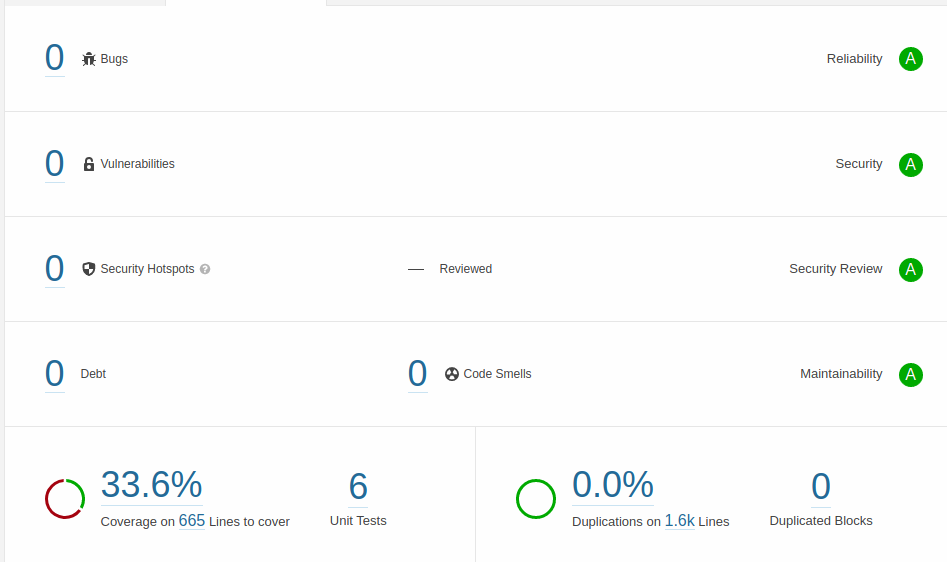

# Java-Spring-Boot-back-film

## Run app

```bash
mvn spring-boot:run
```

Swagger: http://localhost:8080/swagger-ui.html

H2 console: http://localhost:8080/h2-console/

## Run service test (6 tests)

```bash
mvn test
```

Les tests de services réalisés en Spring Boot sont reportés avec Jacoco afin 
d'être intégré dans les analyses Sonarqube.



## Site

Une partie des fichiers sources ont été inspecté et corrigé selon les 
retours du plugin maven Site.

## Détails du contenu

* Les web-services renvoient des pages et non pas la bdd complète
* Quand nécessaire, les fonctions renvoient des Optional pour traiter 
  proprement le cas des enregistrements inconnus
* La base de donnée comprend des films, des reéalisateurs et des genres
* Le code a été vérifié avec le plugin Site et SonarQube.
* La plupart des fonctions haut-niveau ont de la javadoc